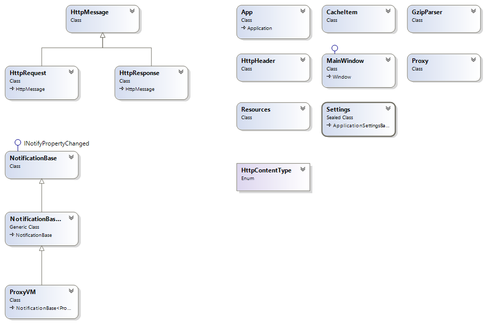
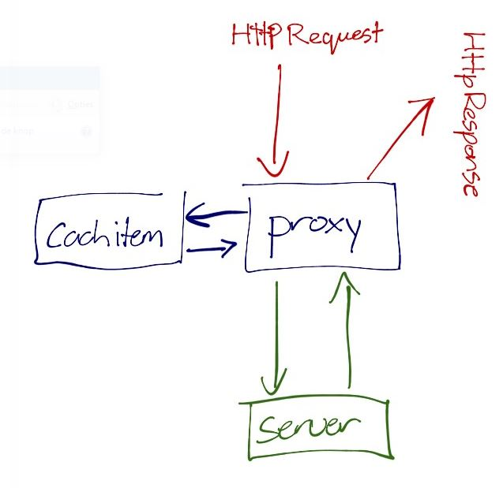

# HTTP Proxyserver

De HTTP Proxy was een opdracht voor de course Web Infrastructures van het semester .Net on the Server aan de Hogeschool van Arnhem en Nijmegen. De opdracht was om in C# .Net een proxy server te bouwen, hiervoor mocht geen gebruik worden gemaakt van de standaard http classes van .Net. Alle communicatie moest vanaf het TCP niveau worden opgebouwd. 

## Requirements

- De proxy kan zowel met HTTP1.0 als HTTP1.1 overweg.
- De proxy kan de identiteit van de client beschermen t.o.v. de server, dit gebeurt door middel van het verwijderen van de user-agent header uit het request.
- De proxy verhoogt de response snelheid door objecten te cachen. Dit wordt standaard gedaan wanneer een item vaker als 5 keer gebruikt wordt of altijd wanneer deze optie is ingeschakeld in de UI. 
- De tijd dat de objecten gecached worden is ook instelbaar vanuit de UI.
- De proxy kan afbeeldingen vervangen door een standaard afbeelding. Deze optie is in te schakelen in de UI.
- De proxy heeft de mogelijkheid om in te stellen dat clients in moeten loggen met een gebruikersnaam en wachtwoord. Het is niet nodig om een database aan te leggen. Een functie die username/password controleert is voldoende.

## Class diagram

## Flow chart

